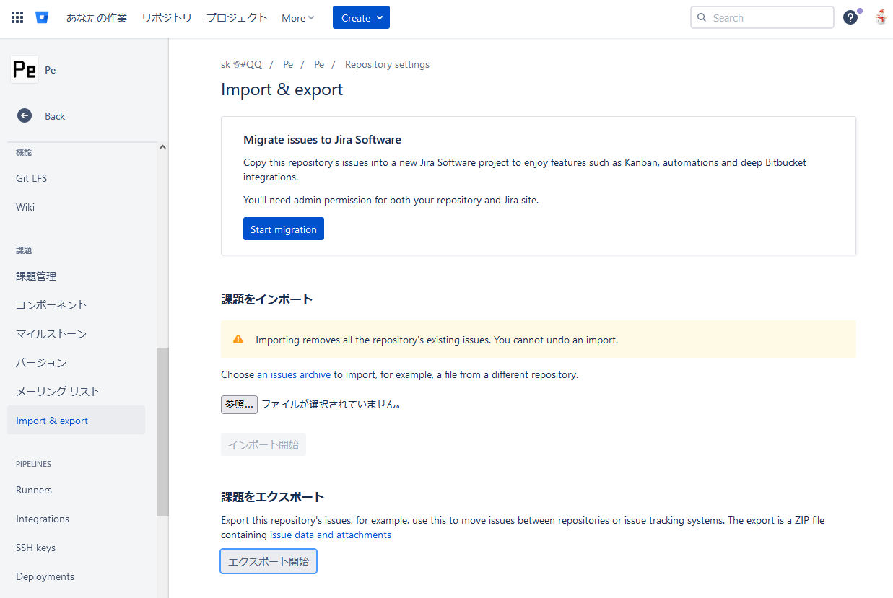

# つかいかた

## 手順

1. GitHub でアクセストークンを生成する。  
   1. GitHub アカウントメニュー（右上）から `Settings` へ遷移
   2. 左メニューの `Developer settings` へ遷移
   3. `OAuth Apps` へ遷移
   4. `New OAuth App` を押下
   5. 各種データ入力
      * **Application name**: `IssueBitBucketToGitHub` ※なんでもいい
      * **Homepage URL**: `http://localhost:9876/`
      * **Authorization callback URL**: `http://localhost:9876/` ※設定ファイルで変更可能
2. BitBucket で課題をエクスポート
  
3. 作業ディレクトリを作成
  * 例として `X:\work` を使用するものとする
  * BitBucket 課題アーカイブを `X:\work\issues` に展開
    * `db-1.0.json` のフルパスが `X:\work\issues\db-1.0.json` をなるように配置されればOK
4. 設定ファイルを作成
  * 下記 **設定ファイル** を参照
5. 起動
  * 下記 **起動** を参照

## 設定ファイル

```json

{
	// 再実施設定
	"Continue": {
		// ラベル構築を行うか
		"BuildLabel": false,
		// 開始課題番号(Bitbucketの課題番号, 再実施しない場合は0)
		"StartIssueNumber": 42
	},
	// GitHub 設定
	"GitHub": {
		// GitHubのURL。通常設定する必要なし
		//"BaseUrl": "",

		// OAuth: クライアントID
		"ClientId": "********************",
		// OAuth: クライアントシークレットキー
		"ClientSecret": "****************************************",

		// 対象リポジトリオーナー
		"Owner": "sk-0520",
		// 対象リポジトリ名
		"Repository": "test"
	},
	// Bitbucket 設定
	"Bitbucket": {
		// Bitbucket エクスポート課題の展開ディレクトリ
		"IssueDirectoryPath": "X:\\work\\issues",
		// Bitbucket エクスポート元課題のURL（元リンクとして使用される）
		"IssueBaseUrl": "https://bitbucket.org/sk_0520/pe/issues"
	},
	// ユーザー設定
	"User": {
		// マッピング
		// bitbucket-user: github-user でマッピングする
		// * はマッピング元が不明な場合に割り当てる github ユーザー
		// 基本的にオーナー設定だけで問題ないはず
		"Mapping": {
			"sk_0520": "sk-0520",
			"*": "sk-0520"
		}
	},
	// 課題の書式
	"Template": {
		//"IssueTitle": "${TITLE} ${NUMBER}"
		//"IssueBody": "${TITLE} ${NUMBER} ${MARKDOWN} ${QUOTE_MARKDOWN} ${URL} ${CREATED_AT} ${USER}"
		//"Comment": "${TITLE} ${NUMBER} ${MARKDOWN} ${QUOTE_MARKDOWN} ${URL} ${CREATED_AT} ${USER}"
	},
	// ラベル
	"Label": {
		// 設定するラベル名。ラベル名を設定する場合は既存のラベルはすべて破棄される
		"Items": [
			"migration:Bitbucket",
			"bug",
			"enhancement",
			"proposal",
			"task",
			"ドキュメント",
			"本体機能",
			"本体起動",
			"アップデート処理",
			"プラグイン",
			"プラグイン\/テーマ",
			"プラグイン\/アドオン",
			"ビルド処理",
			"テレメトリー",
			"プラグイン\/テーマ\/標準",
			"ソース",
			"プラグイン\/参照実装"
		],
		// 強制的に設定するラベル
		"Force": "migration:Bitbucket",
		// API都合で何かしら補正が行われた場合に設定するラベル
		"Omit": "migration:omit",
		// Bitbucket の各項目を対象ラベルとして割り当てる
		"Mapping": {
			// タイプ
			"Kinds": {
				"bug": "bug",
				"enhancement": "enhancement",
				"proposal": "proposal",
				"task": "task"
			},
			// コンポーネント
			"Components": {
				"ドキュメント": "ドキュメント",
				"本体機能": "本体機能",
				"本体起動": "本体起動",
				"アップデート処理": "アップデート処理",
				"プラグイン": "プラグイン",
				"プラグイン\/テーマ": "プラグイン\/テーマ",
				"プラグイン\/アドオン": "プラグイン\/アドオン",
				"ビルド処理": "ビルド処理",
				"テレメトリー": "テレメトリー",
				"プラグイン\/テーマ\/標準": "プラグイン\/テーマ\/標準",
				"ソース": "ソース",
				"プラグイン\/参照実装": "プラグイン\/参照実装"
			}
		}
	}
}

```

## 起動

* 初回起動
  * `IssueBitBucketToGitHub.exe --setting 設定ファイルパス`
  * OAuth 認可とアクセスキーコピーのタイミングがあるので必要に応じて処理
* 再実行
  * `IssueBitBucketToGitHub.exe --setting 設定ファイルパス --access-token=初回実行時のアクセスキー`

